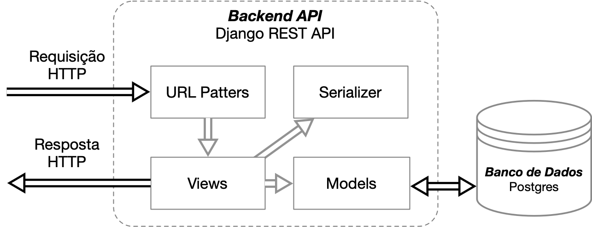

# API

A implementação da API (Backend) do sistema utiliza o framework Django REST com os seguintes módulos:
- **Requisições HTTP**: são capturadas e reconhecidas pelo módulo de **Padrão de URL** (URL  Patterns) e encaminhada para a camada de **Visualziação** (Views).
- O módulo de **Visualização** (Views) por sua vez pricessa as requisições HTTP e retorna Respostas HTTP a partir do módulo de **Serialização** (Serializer).
- O módulo de **Serialização** (*Serializer*) serializa e deserializa os Objetos de Modelo de Dados (Data Model Objects).
- Os **Objetos de Modelo de Dados (Models)** descrevem os atributos dos objetos de dados que persistem no sistema e implementam os comportamentos padrão de CRUD junto ao banco de dados.

A figura a seguir detalha os fluxos do backend.

