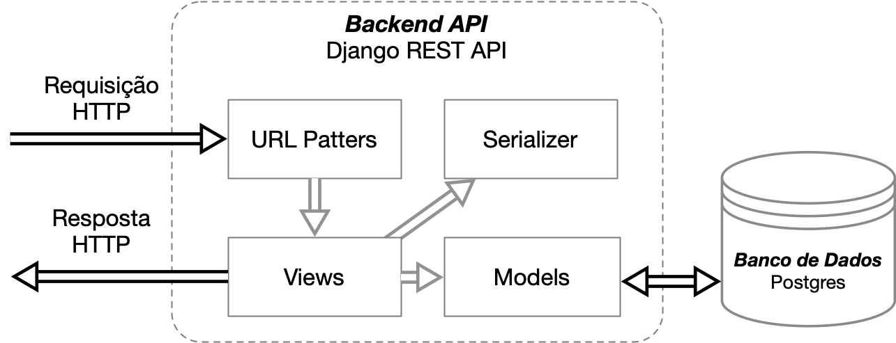

# Arquitetura

O sistema foi definido como um serviço Web, podendo assim ser acessado via navegadores independente de sistema operacional. 

A arquitetura geral adotada é composta por uma camada de interface gráfica Web (frontend), implementada em tecnologia React JS (https://reactjs.org) utilizando o framework Next.js (https://nextjs.org/), e uma camada de servidor (backend) baseada no framework Django REST (https://www.django-rest-framework.org). Nesta arquitetura, o armazenamento permanente de dados é implementado a partir de um banco de dados Postgres (https://www.postgresql.org) abstraído a partir de um conector do framework Django.

A comunicação entre as camadas do frontend e backend é implementada através de uma API no padrão REST. Já a comunicação do backend com o banco de dados é realizada através de um conector próprio incorporado ao framework Django REST. 

## API (Backend)

A implementação da API (Backend) do sistema utiliza o framework Django REST com os seguintes módulos:
- **Requisições HTTP**: são capturadas e reconhecidas pelo módulo de **Padrão de URL** (URL  Patterns) e encaminhada para a camada de **Visualziação** (Views).
- O módulo de **Visualização** (Views) por sua vez pricessa as requisições HTTP e retorna Respostas HTTP a partir do módulo de **Serialização** (Serializer).
- O módulo de **Serialização** (*Serializer*) serializa e deserializa os Objetos de Modelo de Dados (Data Model Objects).
- Os **Objetos de Modelo de Dados (Models)** descrevem os atributos dos objetos de dados que persistem no sistema e implementam os comportamentos padrão de CRUD junto ao banco de dados.

A figura a seguir detalha os fluxos do backend.

## Web (Frontend)

A arquitetura do frontend utiliza o framework Next.js para React junto à biblioteca Redux. Neste caso, temos os seguintes componentes principais:

O **Next.js** (https://nextjs.org) é um framework que provê os componentes, ferramentas e configuradores para criação de aplicações Web utilizando o React. 
O **React** (https://reactjs.org) é uma biblioteca open source em JavaScript para criação de aplicações web criada e mantida pelo Facebook.
O **Redux** (https://redux.js.org) é um biblioteca que implementa a arquitetura Flux que oferece as funcionalidades de gerência consistente de estados para organizar o fluxo de dados em uma aplicação React.

A figura abaixo ilustra os fluxos dos componentes da arquitetura React + Redux descrita a seguir:

**Componente**: é o elemento central da interface da aplicação, podendo ser o container da página, o botão, campo de texto, um formulário etc. O componente é acionado através da ação do usuário pelo navegador via roteador (que gerencia as rotas ou URLs). 
**Propriedades (Props)**: as propriedades ou props são as variáveis de estado do sistema que, a cada mudança, ativam a renderização dos componentes.
Container: elemento de conexão entre o React e o Redux incluindo o Mapa Props-Store.
**Ação / Criador de Ação**: a partir da interação de um usuário com um componente, um evento é gerado e passado pelo container para o criador de ação que irá passar os dados para o redutor ou para um serviço e executar a função desejada.  
**Redutor**: é a lógica de função síncrona que trata o evento e executa a função respectiva.
**Serviço**: é o módulo que pode chamar funções assíncronas como uma requisição a uma API.
**Armazenamento (store)**: finalmente o armazenamento é onde ocorre a mudança de estado e a persistência local do novo estado da aplicação. Isso gera a atualização das propriedades que por sua vez dispara uma nova renderização do componente.
