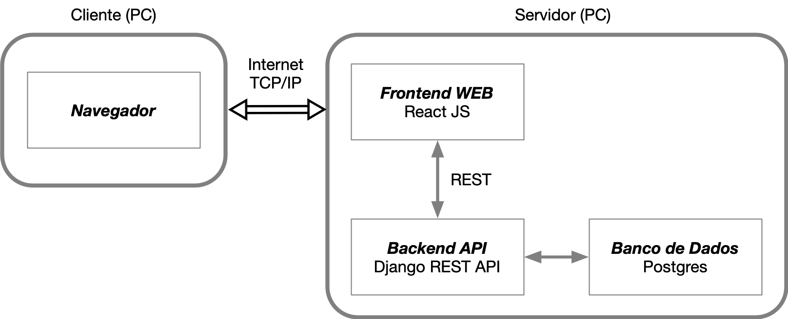

# Introdução 

O sistema MEC-Energia tem por objetivo auxiliar as instituições de ensino superior (IES) a gerenciar e avaliar a adequação de contratos de conta de energia elétrica a partir do registro das faturas mensais de energia, gerando relatórios de recomendações de ajustes nos contratos visando economia de recursos.

## Arquitetura

O sistema foi definido como um serviço Web, podendo assim ser acessado via navegadores independente de sistema operacional. 

A arquitetura geral adotada é composta por uma camada de interface gráfica Web (frontend), implementada em tecnologia React JS (https://reactjs.org) utilizando o framework Next.js (https://nextjs.org/), e uma camada de servidor (backend) baseada no framework Django REST (https://www.django-rest-framework.org). Nesta arquitetura, o armazenamento permanente de dados é implementado a partir de um banco de dados Postgres (https://www.postgresql.org) abstraído a partir de um conector do framework Django.

A comunicação entre as camadas do frontend e backend é implementada através de uma API no padrão REST. Já a comunicação do backend com o banco de dados é realizada através de um conector próprio incorporado ao framework Django REST. 

