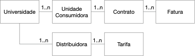

# Introdução 

Esta documentação oferece uma visão geral arquitetural abrangente do sistema, usando diversas visões arquiteturais para representar diferentes aspectos do sistema. O objetivo deste documento é apresentar os requisitos, arquitetura, fluxos de usuário e telas do sistema, demonstrando sua implementação. O público-alvo consiste dos membros contratantes e da equipe de desenvolvimento servindo de documentação.

## Escopo

O sistema tem por objetivo avaliar a adequação de contratos de conta de energia elétrica em instituições de ensino superior a partir do registro das faturas mensais de energia, gerando relatórios de recomendações de ajustes nos contratos visando economia de recursos.

O escopo deste documento envolve o registro de todas as entidades envolvidas no sistema (objetos a serem cadastrados) e os perfis de usuário. Em seguida, a descrição das relações entre as entidades e as funcionalidades esperadas. Além disso, a documentação apresenta a arquitetura do sistema envolvendo a descrição das camadas, tecnologias e protocolos de comunicação envolvidos. Por fim, são apresentadas as telas e fluxos de usuários do sistema, baseado na proposta inicial e já refinada com testes de interface gráfica com usuários finais da plataforma.

##	Entidades 

Antes de apresentar todas as camadas do sistema, para contextualizar, iremos definir as entidades que são os elementos que serão gerenciados pelo sistema com operações básicas de criação, visualização, atualização e remoção. A listagem das entidades e suas relações básicas é demonstrada na Figura 1.

Figura 1 - Diagrama de Entidades do Sistema

A seguir, são apresentadas as descrições de cada uma das entidades: 
- **Universidade**: as universidades são as entidades de mais alto nível e que vinculam todas as demais entidades. Todas as demais entidades do sistema são vinculadas a uma determinada universidade, incluindo os usuários da própria universidade (não listados no diagrama);
- **Unidade Consumidora**: conjunto composto por instalações, ramal de entrada, equipamentos elétricos, condutores e acessórios, incluída a subestação, quando do fornecimento em tensão primária, caracterizado pelo recebimento de energia elétrica em apenas um ponto de entrega, com medição individualizada, correspondente a um único consumidor e localizado em uma mesma propriedade ou em propriedades contíguas. No sistema, a unidade consumidora é a entidade que efetivamente possui um contrato de fornecimento de energia com uma distribuidora. Cada universidade geralmente possui uma ou mais unidades consumidoras. A maior parte das universidades públicas possui até mais de uma dezena de unidades consumidoras que pode ser organizada por campus ou por um subconjunto de prédio de um campus;
- **Contrato**: o contrato é a entidade que registra a relação entre a unidade consumidora e a distribuidora incluindo o fornecimento de energia, as demandas contratadas, o modo de contratação, dentre outros. Cada unidade consumidora possui somente um contrato em vigência em um determinado momento. Porém, é possível efetuar renovações de contrato e manter o histórico de contratos anteriores;
- **Fatura**: documento comercial que apresenta a quantia monetária total que deve ser paga pelo consumidor à distribuidora, em função do fornecimento de energia elétrica, da conexão e uso do sistema ou da prestação de serviços, devendo especificar claramente os serviços fornecidos, a respectiva quantidade, tarifa e período de faturamento. É um documento mensal vinculado a um contrato e registra os dados de consumo e demanda medidas de um determinado mês do ano bem como os valores cobrados. Portanto, cada contrato terá uma nova fatura por mês até que ele seja renovado ou suspenso;
- **Distribuidora**: agente titular de concessão ou permissão federal para prestar o serviço público de distribuição de energia elétrica. No sistema, é a entidade que fornece energia e estabelece o contrato com as universidades;
- **Tarifas**: as tarifas registram os valores cobradas por uma determinada distribuidora para cada item do contrato. As tarifas são classificadas por subgrupos de acordo com a resolução da ANEEL. Portanto, cada distribuidora possui um conjunto de tarifas aplicadas para cada subgrupo. As tarifas são reajustadas anualmente pelas distribuidoras e esse ajuste independe dos contratos estabelecidos.

Este sistema foi concebido para registrar somente unidades consumidoras enquadradas no Grupo A, as quais se caracterizam por possuir fornecimento de energia elétrica via rede de distribuição em média tensão e faturadas por Tarifa Horo-Sazonal (THS) Azul ou THS Verde.

**Grupo A**: grupamento composto de unidades consumidoras com fornecimento em tensão igual ou superior a 2,3 kV, ou atendidas a partir de sistema subterrâneo de distribuição em tensão secundária, caracterizado pela tarifa binômia e subdividido nos seguintes subgrupos: 
- subgrupo A1 - tensão de fornecimento igual ou superior a 230 kV;
- subgrupo A2 - tensão de fornecimento de 88 kV a 138 kV;
- subgrupo A3 - tensão de fornecimento de 69 kV;
- subgrupo A3a - tensão de fornecimento de 30 kV a 44 kV;
- subgrupo A4 - tensão de fornecimento de 2,3 kV a 25 kV; 
- subgrupo AS - tensão de fornecimento inferior a 2,3 kV, a partir de sistema subterrâneo de distribuição.

## Metas e Restrições da Arquitetura 

Requisitos e restrições do sistema que influenciam na arquitetura:
- O sistema funciona em um servidor e, portanto, é necessária a conexão com internet para utilização do sistema;
- Não há código fonte legado (o sistema está todo sendo feito do zero) baseado em frameworks open source;
- As únicas informações de identificação do usuário armazenadas no sistema são o nome, e-mail, senha do próprio sistema e a universidade ao qual ele está vinculado. Portanto, há somente uma mínima identificação do usuário sem armazenamento de dados pessoais sensíveis;
- O acesso ao sistema é feito a partir de login (email e senha) cuja autenticação envolve a geração de tokens de acesso para que a comunicação entre o frontend e o backend seja realizada de maneira criptografada. Já a comunicação entre o backend e o banco de dados é realizada à partir de configuração de usuário e senha locais e o acesso ao banco de dados pode ser configurado para que a porta de seu serviço fique exposta somente para o servidor que esteja executando o backend, limitando as possibilidades de acesso externos e possíveis ataques.
- O sistema foi elaborado com foco no usuário Técnico da Universidade. Portanto, todas as funcionalidades estão voltadas para que ele possa inserir os dados relacionados aos contratos de Faturas das unidades consumidoras e gerar, a partir disto, as recomendações de ajustes de contrato com as distribuidoras;
- O sistema somente considera faturas de energia do Grupo A, não estando previsto o cadastro de faturas ou mesmo qualquer recomendação feita para contratos de outros grupos;
- A aplicação terá suporte a qualquer sistema operacional que utilize um browser moderno (Chrome, Firefox, Edge, Safari etc.);
- O desenvolvimento da aplicação está sendo realizado com o framework Django REST API na versão 4.1, o banco de dados Postgres na versão 14.5 e o framework React Next.JS na versão 12.3.