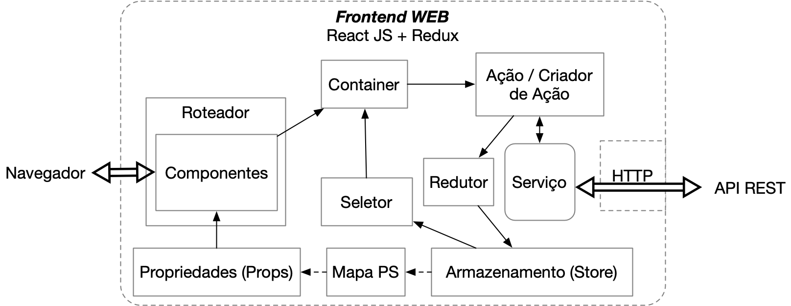

# Web

A arquitetura do frontend utiliza o framework Next.js para React junto à biblioteca Redux. Neste caso, temos os seguintes componentes principais:

O **Next.js** (https://nextjs.org) é um framework que provê os componentes, ferramentas e configuradores para criação de aplicações Web utilizando o React. 
O **React** (https://reactjs.org) é uma biblioteca open source em JavaScript para criação de aplicações web criada e mantida pelo Facebook.
O **Redux** (https://redux.js.org) é um biblioteca que implementa a arquitetura Flux que oferece as funcionalidades de gerência consistente de estados para organizar o fluxo de dados em uma aplicação React.

A figura abaixo ilustra os fluxos dos componentes da arquitetura React + Redux descrita a seguir:

**Componente**: é o elemento central da interface da aplicação, podendo ser o container da página, o botão, campo de texto, um formulário etc. O componente é acionado através da ação do usuário pelo navegador via roteador (que gerencia as rotas ou URLs). 
**Propriedades (Props)**: as propriedades ou props são as variáveis de estado do sistema que, a cada mudança, ativam a renderização dos componentes.
Container: elemento de conexão entre o React e o Redux incluindo o Mapa Props-Store.
**Ação / Criador de Ação**: a partir da interação de um usuário com um componente, um evento é gerado e passado pelo container para o criador de ação que irá passar os dados para o redutor ou para um serviço e executar a função desejada.  
**Redutor**: é a lógica de função síncrona que trata o evento e executa a função respectiva.
**Serviço**: é o módulo que pode chamar funções assíncronas como uma requisição a uma API.
**Armazenamento (store)**: finalmente o armazenamento é onde ocorre a mudança de estado e a persistência local do novo estado da aplicação. Isso gera a atualização das propriedades que por sua vez dispara uma nova renderização do componente.
