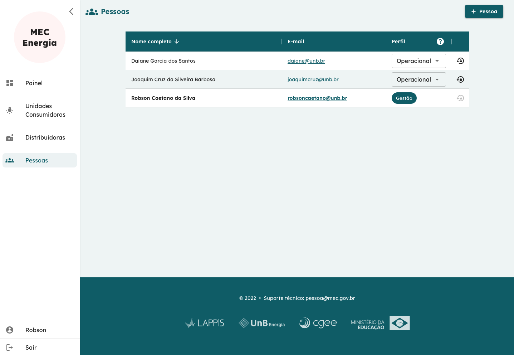

# Usuário Administrador da Universidade

O perfil do usuário Administador da Universidade, além de realizar todas as tarefas do perfil Operacional, tem permissão de gerenciar os usuários e seus respectivos perfis.

No exemplo da tela acima, além de ver a lista de usuários, é possível:

- Adicionar novo usuário pelo botão **+ Pessoa** no canto direito superior;  
- Modificar o perfil de usuários pelo menu _dropdown_ mostrado na penúltima coluna da tabela;  
- Solicitar renovação de senha de usuários pelo botão na última coluna da tabela.

**Obs.**: Não é possível que o usuário modifique seu próprio perfil. Isso evita o caso de haver um único administador da universidade e o mesmo perder estes privilégios.

