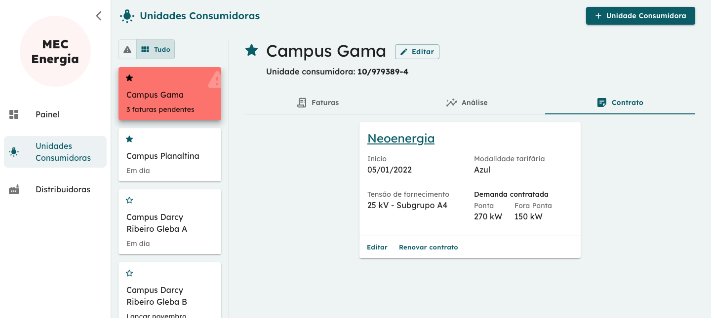

# Usuário Operacional Universidade

Este manual descreve o funcionamento do sistema de acordo com o perfil do usuário **Operacional**, ou seja, o usuário técnico que fará a maior parte do uso do sistema.

## Login

A primeira página ao qual o usuário é apresentado é a tela de login onde o usuário deverá inserir as credenciais de acesso: e-mail e senha.

## Painel inicial

A tela inicial, após o usuário ter realizado o login é o Painel Inicial.

Esta tela é a primeira visão que o usuário Operacional da Universidade terá ao acessar o sistema. Nela é possível ter uma visão panorâmica de todas as Unidades Consumidoras (UCs) onde, além de estarem listadas, também mostram seu estado atual que evidencia pendências como Faturas do mês atual a serem lançadas ou pendências anteriores. A partir desta tela é possível ir direto à tela de uma Unidade Consumidora em específico, ir direto para uma pendência ao clicar no ícone de pendências ou mesmo ir direto para o relatório de recomendações. 

O usuário pode ainda definir as Unidades Consumidoras favoritas, definindo a ordem de prioridade em que elas serão mostradas sendo possível também filtrar a listagem por pendências, unidades ativas ou listar todas (Menu no canto superior direito).  

Além disso, distribuidoras com pendências no cadastro de tarifas (tarifas vencidas que precisem ser atualizadas) também são incluídas neste Painel Inicial.

Por fim, à esquerda o usuário tem acesso ao menu para navegar diretamente para as demais telas.

No canto direito superior está a função de filtro onde é possível selecionar entre três opções: mostrar todas as entidades (UCs e Distribuidoras), somente as pendências ou somente as entidades ativas.

## Unidade Consumidora

A tela de **Unidade Consumidora** (UC) é composta por dois painéis principais. O primeiro, à esquerda, lista todas as unidades consumidoras (lista vertical) enquanto o painel central mostra em seu topo as informações resumidas da UC e abaixo está organizado em 3 abas: *Faturas*, *Análise* e *Contrato*.  

As ações gerais possíveis aqui são a de **_adicionar nova UC_** (Botão no canto direito superior) e **_editar_** informações da UC.

### **Faturas**

Seguindo para a organização das abas, a primeira (*Faturas*), visível na figura abaixo, apresenta ao usuário todas as faturas cadastradas e as pendências em formato de uma tabela com os campos mais relevantes de cada fatura. Damos destaque à segunda coluna que indica se uma fatura deve ou não ser considerada na análise de recomendação. Isso se faz necessário em caso de exceção para que a recomendação gerada não seja enviesada (Ex: no caso de mês em pandemia, greve etc.) e afetada por eventos que mudem drasticamente o perfil de consumo.

A barra no topo da tabela permite selecionar os anos e filtrar por pendências. 

As ações possíveis são as de edição e exclusão (Na úlitma coluna à direita) e os botões para lançar faturas (Em vermelho as faturas em atraso e em verde o lançamento da fatura do mês).

### **Análise**

A segunda aba (*Análise*) apresenta o relatório resumido de recomendações indicando um possível ajuste no contrato da Unidade Consumidora.

Recomendações só são indicadas no caso de economia acima de **5%**. Além disso, são calculadas baseado nos últimos 12 meses de faturas cadastradas. Caso existam 6 faturas ou menos, uma recomendação não é calculada. Alertas são indicados em casos onde há entre 6 e 12 faturas cadastradas.

No layout da página aba de Análise são apresentados quatro quadros contendo as seguintes informações:

#### Quadro 1 - Recomendação
 1. Recomendação: Resumo da recomendação indicando se a modalidade tarifária continua a mesma ou não;
 2. No caso de sugestão de contrato na modalidade _Verde_, a Demanda Contratada. Na _Azul_, os valores recomendados para Demanda de Ponta e Fora de Ponta.  

**Obs.**: 

#### Quadro 2 - Comparatudo do custo-base

O gráfico comparativo do **custo-base** é calculado multiplicando o consumo medido (ou a demanda medida) pelas tarifas vigentes. Ele desconsidera outros elementos que costumam fazer parte do
valor total das faturas como: tributos, encargos setoriais, bandeiras tarifárias e cobranças adicionais, já que dificultariam a análise. Por isso o custo-base é sempre menor que o valor da fatura.

Essa comparação se faz necessária pois considera somente a parte variável da fatura que pode ser ajustada pela mudança de contrato.

#### Quadro 3 - Consumo Medido

Gráfico do Consumo Medido gerado à partir dos valores de consumo de ponta e fora de ponta medidos e registrados nas faturas.

#### Quadro 4 - Demanda Medida

Gráfico da Demanda Medida gerado à partir dos valores de demanda de ponta e fora de ponta medidas e registrados nas faturas.

Além da visão resumida, é possível ainda visualiar o relatório completo clicando no botão **Ver análise detalhada**.

### **Contrato**

Por fim, a aba Contrato apresenta os detalhes do contrato vigente com as opções de correção dos dados ou de renovação para gerar um novo contrato.

As duas ações possível são:  
- **Editar**: ação que permite corrigir informações que tenham sido registradas de maneira errada no contrato.
- **Renovar contato**: ação que permite criar um novo contrato, seja com a mesma distribuidora ou com uma nova distribuidora. Neste caso, o contato anterior é desativado e o novo entra em vigência.

As imagens abaixo mostram os formulários de edição e renovação de contrato.

## Distribuidoras

A tela de Distribuidoras segue uma lógica semelhante à anterior sendo composta por dois painéis principais. O primeiro à esquerda lista todas as distribuidoras (lista vertical) enquanto o painel central está organizado em abas referentes aos subgrupos tarifários. Neste caso, cada aba representa um subgrupo que só fica visível caso existam contratos vigentes com a distribuidora em questão e que pertençam ao subgrupo.  

Em cada aba (subgrupo) é possível visualizar a tabela com os valores das tarifas (Azul e Verde) bem como a listagem de Unidades Consumidoras que estão vinculadas à esta distribuidora e a este subgrupo tarifário.  

A adição de uma nova distribuidora pode ser realizada à partor do botão **+ Distribuidora** no canto superior direito.

Os valores de tarifas são adicionados ou editados em formulários próprios e seguem a determinação da ANEEL.

