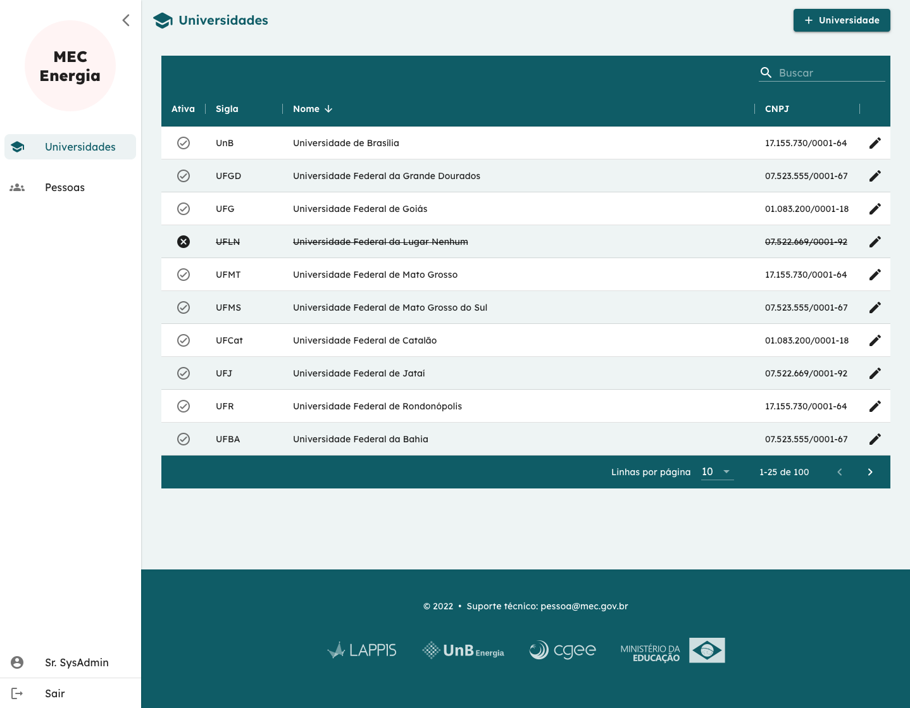
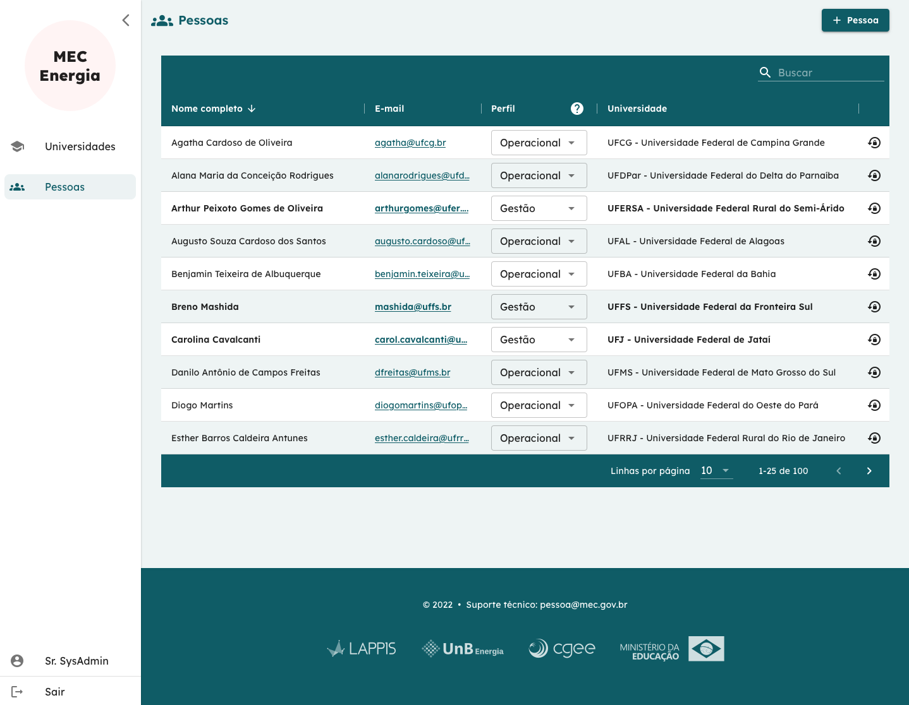

# Usuário Administrador do Sistema

O perfil do usuário Administador do Sistema tem um papel exclusivo de administrar o cadastro de universidades e de usuários. Neste caso, não tem permissão para visualizar ou alterar dados de faturas, contratos, etc. de universidades.  

## Gerenciar Universidades 

Universidades são cadastradas contendo somente o seu nome completo, sua sigla e CNPJ. Portanto, sua administração se baseia em manter estes dados podendo no máximo editá-los em caso de erro ou desativar uma universidade.

Não é permitido apagar informações do sistema.

## Gerenciar Pessoas 

A gestão de pessoas ocorre em nível geral do sistema. Aqui o administrador pode visualizar todos os usuários de todas as universidades e gerenciar seus respectivos perfis.

No exemplo da tela acima, além de ver a lista de usuários, é possível:

- Adicionar novo usuário pelo botão **+ Pessoa** no canto direito superior;  
- Modificar o perfil de usuários pelo menu _dropdown_ mostrado na penúltima coluna da tabela;  
- Solicitar renovação de senha de usuários pelo botão na última coluna da tabela.

**Obs.**: Não é possível que o usuário Administrador do Sistema modifique seu próprio perfil. Isso evita o caso de haver um único administador da universidade e o mesmo perder estes privilégios.
